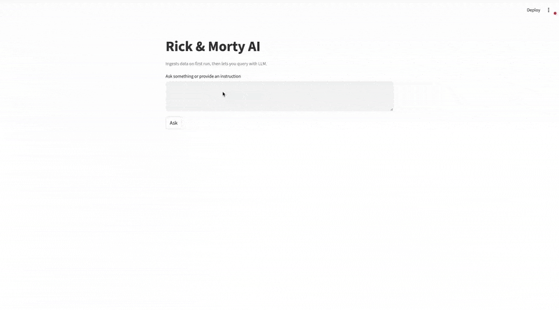

# Rick & Morty AI (Streamlit • SQLite • Ollama/Llama 3.1)

An interactive app that:

- Ingests Rick & Morty data from the public GraphQL API into a local SQLite database
- Lets you ask natural‑language questions; 
- Stores new “Notes” and automatically embeds them (via `nomic-embed-text` on Ollama) to support fuzzy + semantic retrieval
- Augments answers with related notes and displays simple per‑answer evaluation (Coverage, Relevance, Completeness)


## Demo

> Replace these placeholders with your recordings so others can preview the app quickly.



[Full Video Walkthrough](video&gif/demo.webm)


## Tech Stack & Rationale

- UI: **Streamlit** – dead‑simple interactive prototyping, fast to share, works locally and via containers.
- Data source: **Rick & Morty GraphQL API** – one endpoint, rich nested data (locations → residents → episodes) with built‑in pagination (`info.next`), making it ideal for one‑shot hierarchical fetches.
- Storage: **SQLite** – single‑file DB for easy local dev and sharing (no infra or services to run).
- LLM runtime: **Ollama** – local, offline‑friendly; avoids cloud keys and keeps iteration fast. We use:
  - Chat model: `llama3.1` for SQL generation and final answer synthesis.
  - Embeddings model: `nomic-embed-text` for semantic note search and evaluation relevance.
- (Optional) **LangChain / LangGraph** are included in `requirements.txt` to enable future chaining/orchestration, but the current app uses a lightweight, explicit flow for clarity.


## Architecture & Key Decisions

### GraphQL

This project adopts **GraphQL** to request precisely the nested shape required (locations → residents → episodes) in a single round‑trip. In practice the app queries:

```
locations(page: $page) {
  info { next }
  results {
    id name type dimension
    residents { id name status species image episode { id } }
  }
}
```

The `info.next` field provides a clear, first‑party pagination signal; the client iterates until `next` is `null`. A comparable REST approach would require additional requests and manual joins, increasing implementation and maintenance cost. If the GraphQL contract changes, a straightforward “increment page until empty” fallback can be used.

### SQLite

**SQLite** provides a single‑file database (`data/rick_and_morty.db`) with zero operational overhead, which is ideal for developer ergonomics and quick adoption. For a read‑heavy workflow (ingest once, query many times), SQLite’s simplicity is a strong fit. Exporting a schema snapshot (`schema/tables_schema.json`) is trivial and supports LLM‑driven generation. For multi‑user or higher throughput scenarios, the data‑access layer in `src/data_store/store.py` can be redirected to PostgreSQL with minimal surface change.

### Embeddings & Retrieval

For note search and answer‑time augmentation, the system relies on **local embeddings** (Ollama’s `nomic-embed-text`) to avoid external dependencies and keep data private. The `Notes` table is intentionally minimal—`notes` (TEXT) and `embedding` (JSON array of floats)—which is straightforward to persist and query in SQLite. Retrieval blends **fuzzy token overlap** (robust to minor textual variation) with **cosine similarity** over embeddings (captures semantic relationships), yielding strong relevance without additional services.

### Evaluation

To provide immediate feedback on answer quality, the UI reports lightweight, explainable metrics:

- **Coverage** – token overlap between the final answer and the combined context (query results + retrieved notes), indicating grounding in the provided evidence.
- **Relevance** – cosine similarity between embeddings of the user question and the final answer; a quick proxy for topical alignment.
- **Completeness** – proportion of meaningful query tokens present in the answer, highlighting potential gaps.

These metrics are intentionally simple and fast to compute, providing practical signal during development and evaluation without external services.


## Project Structure

```
Rick_and_Morty_AI/
├─ data/                   # SQLite DB (created on first run)
├─ schema/
│  └─ tables_schema.json   # exported DB schema used by the LLM to craft SQL
├─ options/
│  └─ ingestion_query      # GraphQL query (locations + residents + episodes)
├─ src/
│  ├─ main.py              # Streamlit app entry point
│  ├─ config/
│  │  ├─ settings.py       # configuration + LLM prompts (env overrides supported)
│  │  └─ __init__.py
│  ├─ data_store/
│  │  ├─ read_api.py       # GraphQL fetch (pagination via info.next)
│  │  ├─ store.py          # SQLite schema + ingestion + simple counts
│  │  └─ __init__.py
│  ├─ llm/
│  │  ├─ llm.py            # Ollama chat + embeddings + answer formatting
│  │  └─ eval.py           # lightweight evaluation helpers
│  └─ search/
│     └─ search.py         # Notes persistence + fuzzy/semantic retrieval
├─ requirements.txt
├─ Dockerfile
├─ docker-compose.yml
├─ .dockerignore
└─ README.md
```


## How to Run (Local venv)


1) **Create a virtual environment & install deps**
```bash
python -m venv .venv
# macOS/Linux
source .venv/bin/activate
# Windows PowerShell: .\.venv\Scripts\Activate.ps1
pip install --upgrade pip
pip install -r requirements.txt
```

2) **Install and start Ollama**
```bash
ollama serve
ollama pull llama3.1
ollama pull nomic-embed-text
```

3) **Run the app**
```bash
streamlit run src/main.py
```
Open the URL printed by Streamlit (typically http://localhost:8501). On first start, the app ingests the GraphQL dataset into `data/rick_and_morty.db`. Subsequent runs reuse it.


## Configurable 
./src/config/settings.py
./options


 